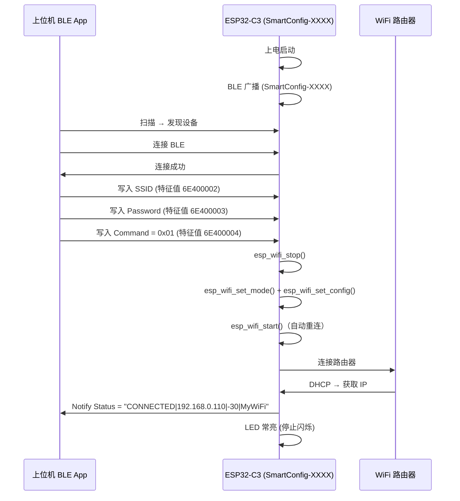
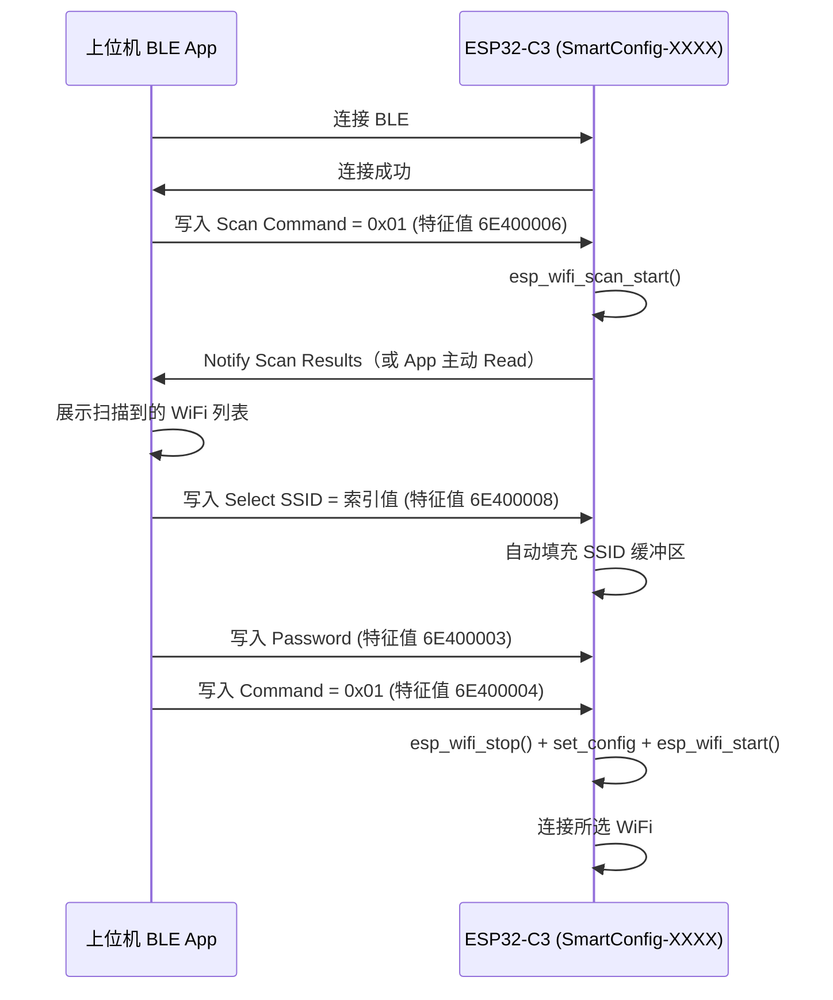

# BLE 配网使用说明

## 概述

本固件使用 **NimBLE** (ESP-IDF 内置的 BLE 协议栈) 实现了 BLE GATT 服务器，上位机（手机/电脑）可通过 BLE 连接设备，配置 WiFi 并读取网络状态。

支持两种配网方式：
- **手动输入** — 直接写入 WiFi 名称和密码
- **扫描选择** — 触发设备扫描周围 WiFi，按索引选择，无需手动输入 SSID

## BLE 服务定义

### UUID

所有特征值使用自定义 128-bit UUID，基础 UUID：`6E400001-B5A3-F393-E0A9-E50E24DCCA9E`

服务 UUID 会在 BLE 扫描响应（Scan Response）中广播，供客户端发现。

#### 配网核心特征值

| 特征值 | UUID | 权限 | 最大长度 | 说明 |
|--------|------|------|----------|------|
| 服务声明 | `6E400001-...` | — | — | WiFi Config 主服务 |
| **SSID** | `6E400002-...` | Write | 32 字节 | 写入 WiFi 名称 (UTF-8)，也可通过扫描选择自动填充 |
| **Password** | `6E400003-...` | Write | 64 字节 | 写入 WiFi 密码 (UTF-8) |
| **Command** | `6E400004-...` | Write | 1 字节 | `0x01` = 使用已写入的凭证连接 Wi-Fi |
| **Status** | `6E400005-...` | Read + Notify | 可变 | 读取/订阅网络状态（含 IP、信号、SSID） |

#### WiFi 扫描特征值

| 特征值 | UUID | 权限 | 最大长度 | 说明 |
|--------|------|------|----------|------|
| **Scan Command** | `6E400006-...` | Write | 1 字节 | `0x01` = 开始扫描周围 WiFi |
| **Scan Results** | `6E400007-...` | Read + Notify | 1024 字节 | 读取扫描结果（格式见下） |
| **Select SSID** | `6E400008-...` | Write | 1 字节 | 按索引选择扫描到的 WiFi（0-based） |

### Status 格式

```
CONNECTED|<IP地址>|<RSSI>|<SSID>
DISCONNECTED|0.0.0.0|0
```

示例：`CONNECTED|192.168.0.110|-30|MyWiFi`

### Scan Results 格式

```
3 AP(s) found
0|MyWiFi|-45|WPA2
1|Neighbor|-60|WPA3
2|PublicNet|-72|OPEN
```

格式：`<索引>|<SSID>|<RSSI>|<认证方式>`

认证方式取值：`OPEN`、`WEP`、`WPA`、`WPA2`、`WPA3`、`WPA/WPA2`、`WPA2_ENT`、`WPA2/WPA3`、`WAPI`

## 配网流程

### 方式一：手动输入 SSID



### 方式二：扫描选择 WiFi（无需手动输入 SSID）



### 详细说明

1. **开机**：设备启动 BLE 广播，名称为 `SmartConfig-XXXX`（XXXX 为 BT MAC 地址后 2 字节）
2. **扫描发现**：使用 BLE 调试工具（如 nRF Connect、LightBlue）扫描可发现设备
3. **连接**：与设备建立 BLE 连接

**方式一（手动输入）**：
4. 向 **SSID** 特征值写入 WiFi 名称
5. 向 **Password** 特征值写入 WiFi 密码
6. 向 **Command** 特征值写入 `0x01` 触发连接

**方式二（扫描选择）**：
4. 向 **Scan Command** 特征值写入 `0x01` → 设备开始扫描周围 WiFi
5. 等待扫描完成（约 3-5 秒），读取或接收 Scan Results 通知
6. 向 **Select SSID** 特征值写入目标 WiFi 的索引（0-based）
7. 向 **Password** 特征值写入 WiFi 密码
8. 向 **Command** 特征值写入 `0x01` 触发连接

**状态反馈**：连接成功后 **Status** 特征值自动 Notify 更新（推送 IP、信号强度、SSID）；也可随时 Read 读取当前状态。

**网络切换**：设备在任何状态下（已连接、重连中、断开）均可通过 BLE 写入 Command 切换 WiFi，配置方式为 `esp_wifi_stop()` → 设置新凭证 → `esp_wifi_start()` 自动重连。

## 使用工具

### nRF Connect (推荐)

1. 打开 nRF Connect → **SCANNER** 页
2. 找到 `SmartConfig-XXXX` 设备 → **Connect**
3. 在 **WiFi Config Service** (`6E400001-...`) 中找到各特征值

**手动配网操作**：
- 点击 **SSID** → 箭头图标 → 写入 WiFi 名称（如 `MyWiFi`）
- 点击 **Password** → 箭头图标 → 写入 WiFi 密码
- 点击 **Command** → 箭头图标 → 写入 `01`（十六进制单字节）

**扫描选择配网操作**：
- 点击 **Scan Command** → 箭头图标 → 写入 `01`
- 等待几秒后，点击 **Scan Results** → `↓` 读取扫描结果
- 根据结果中的索引，点击 **Select SSID** → 箭头图标 → 写入索引（如 `00`）
- 点击 **Password** → 箭头图标 → 写入 WiFi 密码
- 点击 **Command** → 箭头图标 → 写入 `01`

查看 **Status** 特征值可随时获取当前网络状态（含 SSID）。

### LightBlue

操作方式类似，在设备服务列表中找到对应 UUID 特征值进行写入和读取。

### Web Bluetooth API

Web 页面可通过 Web Bluetooth API 连接设备：

```javascript
// 请求设备（通过服务 UUID 过滤器）
const device = await navigator.bluetooth.requestDevice({
  filters: [{ services: ['6e400001-b5a3-f393-e0a9-e50e24dcca9e'] }]
});

// 连接 GATT 服务端
const server = await device.gatt.connect();

// 获取 WiFi Config 主服务
const service = await server.getPrimaryService(
  '6e400001-b5a3-f393-e0a9-e50e24dcca9e'
);

// 读写特征值
const ssidChar = await service.getCharacteristic('6e400002-b5a3-f393-e0a9-e50e24dcca9e');
const pwdChar  = await service.getCharacteristic('6e400003-b5a3-f393-e0a9-e50e24dcca9e');
const cmdChar  = await service.getCharacteristic('6e400004-b5a3-f393-e0a9-e50e24dcca9e');
const statusChar = await service.getCharacteristic('6e400005-b5a3-f393-e0a9-e50e24dcca9e');
const scanCmdChar = await service.getCharacteristic('6e400006-b5a3-f393-e0a9-e50e24dcca9e');
const scanResChar = await service.getCharacteristic('6e400007-b5a3-f393-e0a9-e50e24dcca9e');
const selectChar  = await service.getCharacteristic('6e400008-b5a3-f393-e0a9-e50e24dcca9e');

// === 手动配网 ===
await ssidChar.writeValue(new TextEncoder().encode('MyWiFi'));
await pwdChar.writeValue(new TextEncoder().encode('password123'));
await cmdChar.writeValue(new Uint8Array([0x01]));

// === 扫描选择配网 ===
await scanCmdChar.writeValue(new Uint8Array([0x01]));
// 等待扫描完成...
const scanRes = await scanResChar.readValue();
console.log(new TextDecoder().decode(scanRes));
// 输出: "3 AP(s) found\n0|MyWiFi|-45|WPA2\n..."
await selectChar.writeValue(new Uint8Array([0]));  // 选择索引 0
await pwdChar.writeValue(new TextEncoder().encode('password123'));
await cmdChar.writeValue(new Uint8Array([0x01]));

// === 读取状态 ===
const value = await statusChar.readValue();
const status = new TextDecoder().decode(value);
console.log(status); // "CONNECTED|192.168.0.110|-30|MyWiFi"
```

## 串口日志监控

配网过程中通过串口输出日志，可用以下命令查看：

```bash
idf.py monitor
```

关键日志：

```
I (548) app_ble: Device name: SmartConfig-0792          # BLE 设备名
I (618) app_ble: Advertising as 'SmartConfig-0792'       # 开始广播
I (618) app_ble: Status: DISCONNECTED|0.0.0.0|0         # 初始状态
I (221) app_ble: BLE connected                           # BLE 已连接

# 扫描选择方式
I (321) app_ble: Starting WiFi scan                      # 开始扫描
I (421) app_ble: Scan done: 5 AP(s) ...                  # 扫描完成
I (521) app_ble: Selected SSID[0]: MyWiFi                # 选择了索引 0
I (621) app_ble: Password set (8 bytes)                   # 收到密码写入
I (721) app_ble: Reconfiguring WiFi for MyWiFi           # 停机切换网络
I (6748) app_ble: Status: CONNECTED|192.168.0.110|-30|MyWiFi  # 连接成功

# 手动输入方式
I (321) app_ble: SSID: MyWiFi                             # 收到 SSID 写入
I (421) app_ble: Password set (8 bytes)                   # 收到密码写入
I (521) app_ble: Reconfiguring WiFi for MyWiFi            # 停机切换网络
```

## 常见问题

### 找不到设备 / 服务 UUID 不匹配

- 确认固件已正确烧录并启动（串口日志应显示 `Advertising as 'SmartConfig-XXXX'`）
- 服务 UUID `6e400001-...` 在 **扫描响应** 中广播，大多数 BLE 调试工具会自动合并显示
- Web Bluetooth 使用 `filters: [{services: [uuid]}]` 时需要服务 UUID 在广播或扫描响应中
- 如果用 nRF Connect / LightBlue 等工具能连接但看不到服务，可能是 GATT 注册失败

### BLE 连接后立即断开

- 日志中 `BLE disconnected, reason=531` 表示客户端超时断开
- 常见原因：客户端发起 GATT 服务发现但未收到响应
- 检查固件是否正确注册了 GATT 服务（重启后观察串口日志）

### WiFi 连接失败

- 检查 SSID 和密码是否正确
- 日志显示 `Wi-Fi disconnected, retrying (1/5)` → 自动重试 5 次
- 5 次失败后自动回退到 SmartConfig 模式
- 可通过 BLE 重新写入正确的凭证

### esp_wifi_set_config 报错

- 如果日志出现 `set_config failed` → 已自动重试解决
- 旧版本使用 `ESP_ERROR_CHECK` 会导致 crash，新版本使用 `esp_wifi_stop()` + `esp_wifi_start()` 在任何状态下均能安全切换网络

## 开发参考

### 代码结构

| 文件 | 说明 |
|------|------|
| `main/app_ble.h` | 对外接口：`app_ble_init()` |
| `main/app_ble.c` | BLE GATT 服务器完整实现（含 WiFi 扫描、状态监控） |
| `main/main.c` | 入口，调用 `app_smartconfig_start()` 后调用 `app_ble_init()` |
| `main/CMakeLists.txt` | REQUIRES 包含 `bt`（NimBLE） |

### 构建

```bash
idf.py build flash monitor
```

### sdkconfig 关键配置

```
CONFIG_BT_ENABLED=y               # 启用蓝牙
CONFIG_BT_NIMBLE_ENABLED=y        # 选择 NimBLE 协议栈
CONFIG_BT_NIMBLE_ROLE_PERIPHERAL=y # 外设角色（广播）
CONFIG_BT_NIMBLE_GATT_SERVER=y    # GATT 服务端
CONFIG_COMPILER_OPTIMIZATION_SIZE=y  # 尺寸优化，满足分区大小
```

### 配网程序流程

```
app_main()
  ├── app_smartconfig_start()   ← 初始化 WiFi、SmartConfig、LED、按键
  └── app_ble_init()            ← 初始化 NimBLE 并开始广播
        ├── 注册 WiFi/IP/Scan 事件处理器
        ├── nimble_port_init()
        ├── ble_svc_gap_init()
        ├── ble_svc_gatt_init()
        ├── ble_svc_gap_device_name_set("SmartConfig-XXXX")
        ├── 注册 WiFi Config GATT 服务（7 个特征值）
        ├── 启动 NimBLE host 任务
        └── on_sync() → start_advertising()
```

### WiFi 切换流程（Command = 0x01）

```
BLE 写入 Command = 0x01
  → esp_wifi_stop()              # 完全停止 WiFi（任何状态均可）
  → esp_wifi_set_mode(STA)
  → esp_wifi_set_config()        # 设置新凭证
  → esp_wifi_start()             # 重启 WiFi → 触发自动连接
  → WIFI_EVENT_STA_START
  → has_stored_wifi_config() = true
  → esp_wifi_connect()
  → IP_EVENT_STA_GOT_IP
  → Status Notify: "CONNECTED|<IP>|<RSSI>|<SSID>"
```

### 配网方式共存

BLE 配网与原有的 SmartConfig 配网**并行共存**：

| 方式 | 触发条件 | 说明 |
|------|---------|------|
| **BLE 配网**（手动输入） | 手机连接 BLE 手动写入 SSID | 已知 WiFi 名称时使用 |
| **BLE 配网**（扫描选择） | 手机连接 BLE 触发扫描→选择 | 无需手动输入 SSID |
| **SmartConfig** | 上电按住 GPIO19 按键 | 传统 ESP-TOUCH/AirKiss |
| **自动重连** | 已有存储的 WiFi 凭证 | 上电自动连接 |
| **回退机制** | 重连失败 5 次后 | 自动进入 SmartConfig 模式 |

### LED 指示

| 状态 | LED |
|------|-----|
| 配网中 / 连接中 | 300ms 闪烁 |
| WiFi 已连接 | 常亮 |
| 未连接 | 灭 |
